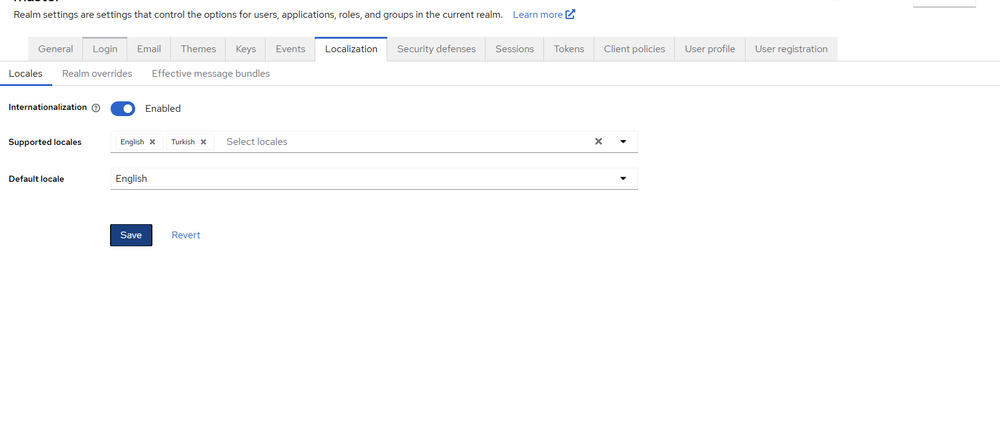
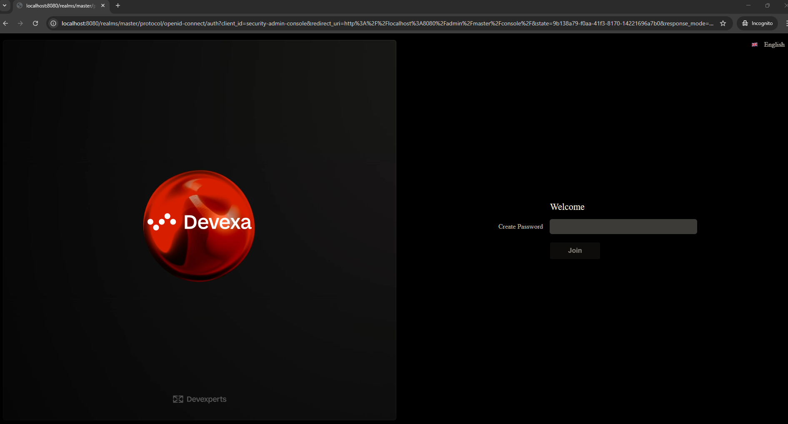
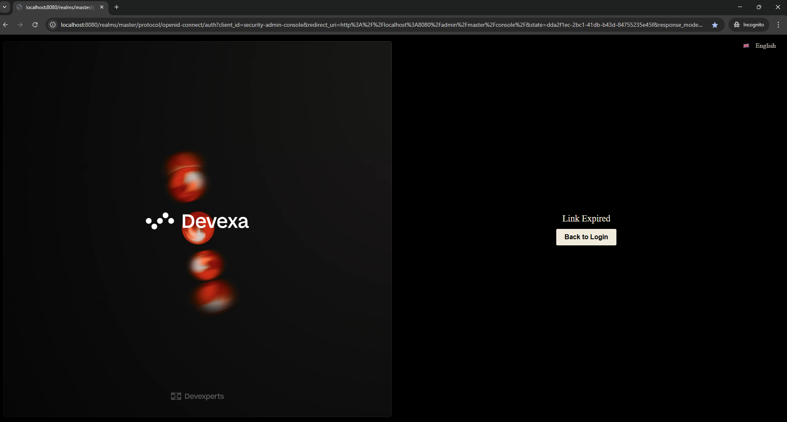

TODO:

- set localization -> change language (required)

update these files go to the current theme
- template.ftl      // common layout 
- login-reset-password.ftl
- login-page-expired.ftl
- update theme.properties
- messages
- resources

step run :
- docker build -t keycloak-theme .
- docker run -p 8080:8080 -e KEYCLOAK_ADMIN=admin -e KEYCLOAK_ADMIN_PASSWORD=admin keycloak-theme start-dev

- set theme
 my-custom-theme

login-reset-password.ftl

login-page-expired.ftl

